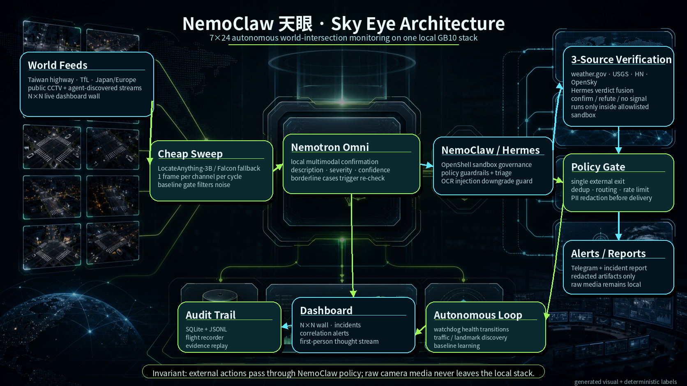
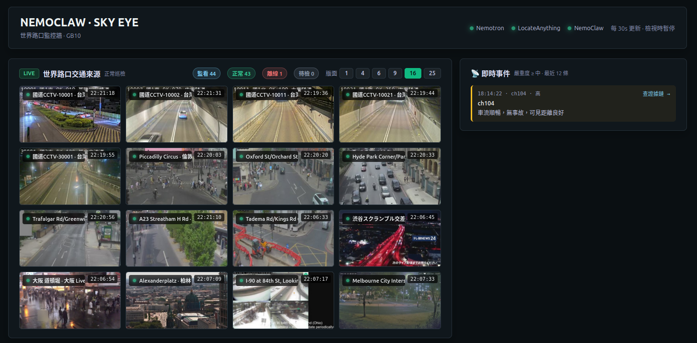
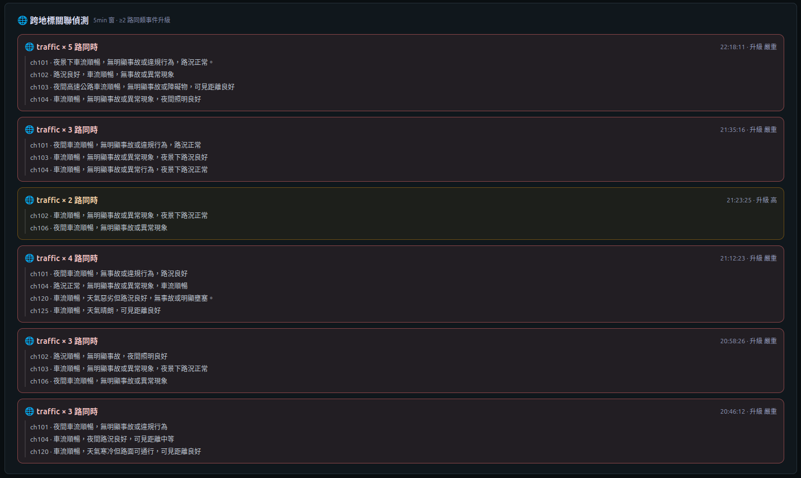
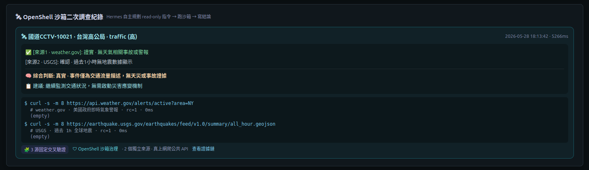
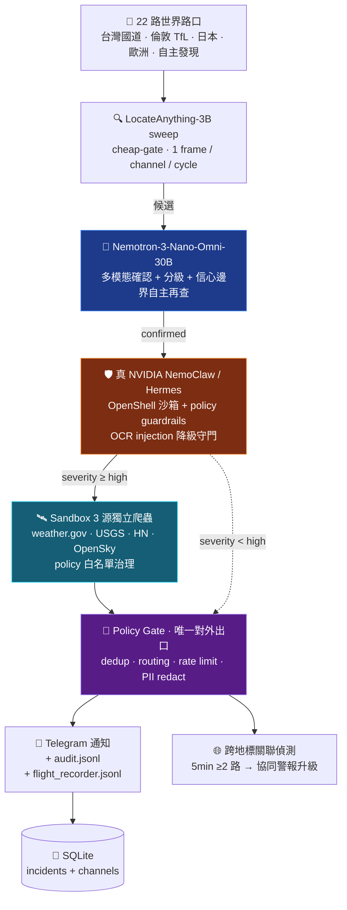

# 🌐 NemoClaw 天眼 · Sky Eye

> **Nemotron 負責看,NVIDIA NemoClaw 負責守。** 單台 DGX Spark **GB10** 上 7×24 自主巡檢世界路口/公共地標的天眼 agent — **LocateAnything-3B 視覺定位 cheap-gate**、自學基線、自主調查與處置、自主上網爬即時情報做跨來源驗證、跨地標關聯升級、事件處置**不需人工核准**,每個動作都受 NemoClaw 政策護欄治理、全程可稽核。

**English version:** [README.en.md](README.en.md)

## 🎬 Demo 影片(2:30)

[](https://www.youtube.com/watch?v=kmVBfhoFfS0)

> 👉 點圖看 YouTube · 完整 7 分鏡含 N×N 監控牆 / OpenShell 3 源驗證 / 跨地標關聯 / Flight Recorder



> 主鏈路:世界路口/公共地標影像 → cheap sweep 初篩 → Nemotron 多模態確認 → NVIDIA NemoClaw / Hermes 治理沙箱 → 3 源即時查證 → policy gate → dashboard / audit / redacted alerts。

---

## ✨ 主要特色

| 能力 | 說明 |
|---|---|
| 🎥 **N×N 監控牆** | 預設 4×4 · 可切 1/4/6/9/16/25;台灣高公局 + 倫敦 TfL + 日本 + 歐洲 + agent 自主發現,共 ~22 路 |
| 🧠 **R2 級聯架構** | LocateAnything-3B 視覺定位(便宜) → Nemotron-Omni 多模態確認(按需) → 真 NVIDIA NemoClaw 治理 |
| 🛰 **OpenShell sandbox 3 源跨來源驗證** | 嚴重事件後 Hermes 在沙箱內主動 `curl weather.gov + USGS + HN + OpenSky` 4 個 sub-hourly 即時源 |
| 🌐 **跨地標關聯偵測** | 5 分鐘窗 ≥2 路同類事件 → 自動升級協同警報(3+ 路 = critical) |
| 🔬 **可看見的自主性** | 第一人稱思考流 ticker:agent 在做什麼即時可見(sweep/baseline/investigate/discover/...) |
| 🛡 **真 NemoClaw 治理** | OpenShell 沙箱 + policy preset `sky-eye-recon` 白名單 4 hosts;`governed_by=nemoclaw-openshell` |
| 🔒 **隱私 by design** | 人臉 redaction 強制;原始畫面 403,只送 redacted artifact;dashboard URL 限定白名單 |
| 📋 **Flight Recorder** | 每事件完整軌跡:sweep → Nemotron raw → grading → NemoClaw triage → policy decision → sandbox followup |
| 💾 **本地儲存** | SQLite 預設(無需 DB server);支援 MongoDB 切換 |
| ⚡ **零雲端推理** | Nemotron + LocateAnything + NemoClaw + dashboard 全部跑在一台 GB10 |

---

## 📸 介面預覽

### 主頁:N×N 監控牆 + 即時事件


預設 4×4 監控牆 · 右側即時事件 panel · 上方版面 chooser(1/4/6/9/16/25)+ 監看/正常/離線統計。

### 🌐 跨地標關聯偵測


5min 窗 ≥2 路同類事件自動升級協同警報。

### 🛰 OpenShell sandbox 3 源跨來源驗證


嚴重事件後 Hermes 在沙箱內主動 curl 公共即時情報(weather.gov / USGS / HN / OpenSky),5 行 verdict 融合(每源證實/否認/無訊號 + 綜合判斷 + 建議)。

---

## 🏗 架構

完整圖見 README 頂端 [`sky-eye-architecture.png`](docs/assets/sky-eye-architecture.png)。流程概覽:



---

## 🚀 快速啟動

```bash
# 1. 環境設定
source nemoclaw/nemoclaw.env

# 2. 確保三服務在跑
docker start vllm-nemotron-omni-nvfp4    # Nemotron :31010
nemohermes sentinel recover               # Hermes :8642
# LocateAnything server (bash nemoclaw/start-locate-anything.sh)           # :18793

# 3. 套用 sandbox 即時情報白名單 policy
nemohermes sentinel policy-add --from-file nemoclaw/policies/sky-eye-recon.yaml --yes

# 4. 登錄頻道 + 啟動常駐 supervisor
python3 nemoclaw/register_channels.py
sudo systemctl start nemoclaw-sentinel

# 5. 開 dashboard
python3 nemoclaw/dashboard/app.py         # http://localhost:8099
```

驗證環境:`bash nemoclaw/demo_prep.sh`(3 步檢查清單)

---

## 📁 主要檔案

```
nemoclaw/
  dashboard/app.py              N×N 監控牆 + 即時事件 + 治理稽核(:8099)
  orchestrator.py               R2 級聯編排(sweep→Nemotron→Hermes→policy→followup)
  sweep.py                      LocateAnything 視覺定位 cheap-gate sweep
  nemoclaw_triage.py            真 NemoClaw Hermes triage(:8642)
  hermes_followup.py            OpenShell sandbox 3 源跨來源即時情報爬蟲
  correlation.py                跨地標關聯偵測(5min 窗 ≥2 路同類)
  discover.py                   agent 自主 yt-dlp 探索(traffic / landmark 兩個 profile)
  policy.py / act.py            Policy gate(唯一對外出口,稽核)
  audit.py / flight_recorder.py 全程稽核 + 事件飛行紀錄
  redact.py                     人臉 redaction(隱私 by design)
  thoughts.py                   第一人稱思考流 ticker
  briefing.py                   自主情勢簡報(agent 排程)
  baseline.py                   per-camera 自學基線(cold-start floor=2)
  watchdog.py                   服務健康監測(transition log)
  curiosity.py                  自主好奇心任務(idle channel 主動巡)
  feed_health.py                channel state watchdog
  world_channels.yaml           seed 22 路世界路口(政府公開 CCTV + YouTube 24/7)
  landmarks.yaml                seed 全球地標(備用 profile)
  policies/sky-eye-recon.yaml   NemoClaw custom policy(4 個即時情報白名單 hosts)
  nemoclaw-sentinel.service     systemd 常駐(開機自啟 / 崩潰自重啟)
  nemoclaw-supervisor.sh        long-running supervisor loop(watchdog + cycle + discover)
  tests/                        136 個單元測試
```

---

## 🎬 Demo 腳本

完整錄製本見 [`nemoclaw/DEMO_SCRIPT.md`](nemoclaw/DEMO_SCRIPT.md)。摘要:

1. **首頁 N×N 監控牆**(0:00-0:25) — 22 路世界路口,切版面 9/25
2. **狀態:本地推理**(0:25-0:50) — `nemohermes sentinel status` 證明 Nemotron + NemoClaw 都在本機
3. **政策白名單**(0:50-1:15) — `nemohermes sentinel policy-list` 看 `sky-eye-recon` preset
4. **🛰 OpenShell 3 源驗證**(1:15-1:45) — 展開「事件紀錄」內的 followup 卡片,看 Hermes 在 sandbox 真 `curl` 即時源
5. **🌐 跨地標關聯**(1:45-2:05) — 看 correlation panel
6. **flight recorder**(2:05-2:20) — 點任一事件「查證據鏈」
7. **定格**(2:20-2:30) — 監控牆 + 即時事件 panel

---

## 📊 對應評審標準

| 要求 | 實現 |
|---|---|
| **核心模型 = Nemotron** ✅ | 每個事件的多模態確認/描述/分級皆由 `Nemotron-3-Nano-Omni-30B`(本機 vLLM :31010) |
| **autonomous / no human in loop** ✅✅ | production supervisor 自動觸發偵測 → 自主調查 → 治理 → 自主分級處置 → 自主上網爬即時情報跨源驗證 → 跨地標關聯升級;處置無人工核准 |
| **long-running 架構** ✅ | cheap-sweep 連續、Nemotron 按需喚起、per-cycle watchdog;systemd 開機自啟、docker `restart=always` 自癒 |
| **real task / deployable** ✅ | 真實 22 路世界路口巡檢;systemd 常駐、SQLite + JSONL 持久化、服務健康探針 |
| **persistent deployment** ✅ | systemd `Restart=always` + `audit.jsonl` + `flight_recorder.jsonl` + `followups.jsonl` + `correlation_alerts.jsonl` |
| **bonus:NemoClaw policy guardrails** ✅✅ | 真 NVIDIA NemoClaw(OpenShell + policy + intent verification);custom `sky-eye-recon` preset 白名單治理 sandbox 能爬什麼 |

---

## 🛠 技術棧

- **多模態 VLM**:Nemotron-3-Nano-Omni-30B-A3B-Reasoning-NVFP4(vLLM 0.20.0)
- **治理 agent**:NVIDIA NemoClaw v0.0.50 + OpenShell sandbox + Hermes
- **感知**:**LocateAnything-3B**(NVIDIA · transformers serve)
- **硬體**:DGX Spark GB10(aarch64, sm_121)
- **持久化**:SQLite(預設,免 DB server)/ MongoDB(選用)
- **通知**:Telegram Bot
- **網頁**:純 Python `http.server`(無外部 web framework)

---

## 📜 授權與第三方模型 License

| 元件 | License | 商業用途 |
|---|---|---|
| 本 repo(NemoClaw Sentinel 程式碼) | MIT | ✅ 允許 |
| **Nemotron-3-Nano-Omni-30B-A3B-Reasoning-NVFP4** | NVIDIA Open Model License | 依模型 license 條款 |
| **NVIDIA NemoClaw v0.0.50 / OpenShell** | Apache-2.0 | ✅ 允許 |
| **LocateAnything-3B**(NVIDIA) | [NVIDIA License](https://huggingface.co/nvidia/LocateAnything-3B/blob/main/LICENSE) | ❌ **僅學術/研究,禁止商業使用**(除非 NVIDIA 授權) |
| Qwen2.5-3B-Instruct(LocateAnything 底層) | Qwen Research License | 非商業 |
| MoonViT-SO-400M(LocateAnything vision encoder) | MIT | ✅ 允許 |

> ⚠ **本作品為 NVIDIA Agent Hackathon 研究用提交**。商業部署需洽 NVIDIA 商業授權。

— Henry Lu · NemoClaw Sentinel · NVIDIA Agent Hackathon · branch `nemoclaw-sentinel`
